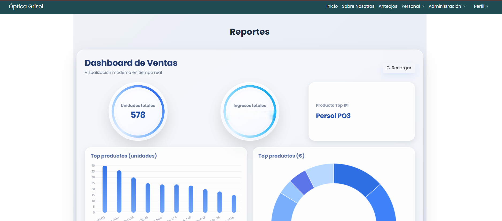
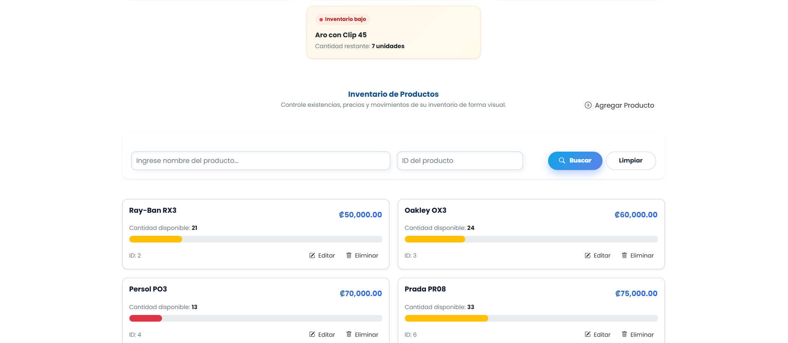

# Portafolio de Proyectos - Lineth Leiva

Desarrolladora de software junior con experiencia en desarrollo web, bases de datos y análisis de datos.

## Proyectos destacados

### Sistema Web - Óptica Grisol

## Capturas del sistema

### Dashboard

### Inventario

### Punto de Venta

### Facturación

### Expediente Digital

### Historial del Paciente

### Cierre de Caja

Sistema en producción para gestión de óptica.

- Inventario
- Facturación
- Expedientes
- Citas
- Reportes

Tecnologías:
PHP, MySQL, JavaScript, HTML, CSS

https://opticagrisol.com/

### Sistema POS
Sistema de ventas con control de inventario y facturación.

Tecnologías:
PHP, MySQL, JavaScript

### Data Warehouse Retail
Sistema de análisis de ventas con modelo estrella y ETL.

Tecnologías:
MySQL, KNIME, Power BI
